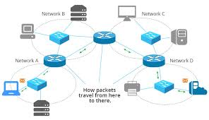
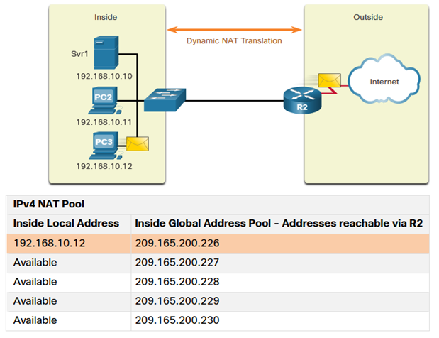
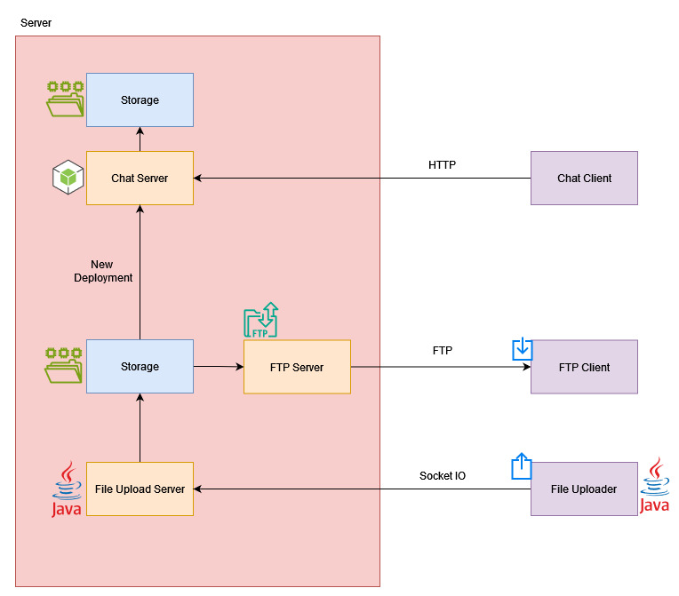
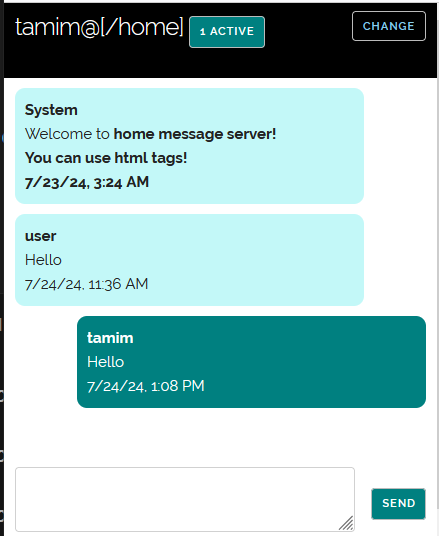

How we stay connected in the recent internet shutdown with some networking knowledge, java and javascript. This will seem simple for many, but let me try to document our effort in the tough time. 

### The Problem

We can't connect to anything using internet. We need someway of communication to know if others are doing okay. Also, new episode of HOTD is out, we need some way to access it and if possible some other too. 

### Basics of Network Routing 

If you have any knowledge of networking you will know how a packet gets from A to B. If you don't, the do not worry. It's not that hard (not that simple too). 

The internet is just a connection between computers. We contact another computer through a series of routers. 

Say you have a server on you desktop. To connect to the server you need to be on the same wifi. Your request goes to your router. Your router sees that the destination is within the network. So, it sends the packet to your computer. It doesn't matter if you have working internet connection or not. 

It gets a bit tricky when the destination is not inside your network. The router sees the destination and finds it outside your network. So, it forwards it to your ISP or any intermediate router hoping that they know where the destination is. The routers uses routing table to send packets to their designated destination or to the router which can sent it to the destintation. I have oversimplified it too much. But for now it will work. 

<!--  -->

When we say the internet is down we mean somewhere down the line some connection is broken. So, theoritically if our sender and reciever is within the same side of the broken connection we can still communicate right? Yes! If the router responsible for forwarding the packets are on (some of the ISP totally turned off their service idk why) then we can communicate. We do some ping to check our theory and viola! It works.

### Finding a static/ real ip user

If you are confident now that you can create a server on your PC and let the world connect to it, you might not yet. You need a real or static IP. Why though? The number or real IP is limited. So, it is costly. Most of the people uses dynamic IP assigned from their ISP ie their IP changes from time to time. When you make some request to the outside world, the ISP assigns a public IP address from a pool of available IP on a first come first serve basis. When the request gets a reply the assigned IP is translated to your address and forwarded to you. This is called Network Access Translation or NAT. Another way is using PAT, where a single IP is used and multiple requests are send using multiple ports. So, if you want to create a server how will you ensure that your client knows you current IP? 

After some searching we found one of our friend has a real IP. That solves the problem. Off to development we go! 

### The System Requirements

Before we describe the system please keep in mind that during development we did not have any internet connection. Time to time you might ask "why on earth is this done this way?" There are better ways, but we do with what we have.

The system will have the following capabilities, 
1. User can create a room or join a existing room
1. User can send and recieve message of a room
1. User can download static contents
1. User can upload static contents for others to download

optional functionalities
1. User can see the number of active users in a room.

We will define 3 services. 
1. The chat service will handle the first two functionality
1. The ftp service will serve static conent
1. A file uploader service will handle file uploads

The chat server will expose 3 api.
1. GET / => serves the ui of the chat
2. GET api/:room/:timestamp => returns all the message of a room after the given timestamp
3. POST api/:room => sends a message to a room

The ftp server exposes a directory from which users can download contents. 

The file uploader service will listen to any upload request and save the files in the directory exposed by the ftp server. 

### The Chat Service

The service is written in simple nodejs and expressjs. 

The client will at first get the html page from the server. The client sends request with an interval of 5 seconds for any new messages (pooling with 5s). The messages are cached in the local storage of the client. 

In the server, the messages are stored in memory. Occasionally when memory usage becomes high, the old messages are written to disk to clear up some space.

When a user sends a request, a entry is added against him with the access time. This is used to calculate the number of active users in a room. A user will be inactive after 1 minute.

### The FTP service

The ftp server is a simple file server based on python. You can find how to create a simple ftp server just by one single command in google. 

### The Uploader Service

Luckily we made this file uploader server client in our networking lab as a weekly assignment. So, let's reuse that.

We used a java based socket io app for file upload. A server listens to a port for new connection. A uploader client will connect to this connection and upload a file. The problem is the client do not have the uploader code. The solution is simple. Serve the uploader client by FTP! 

The uploader server is off by default. If anyone wants to upload something, they contacts the owner and he turns it on.

We can use this uploader service to upload new versions of the system. 3 versions was deployed in total. 

### Some calculations

The system was designed to be used within our friends. So the user count is very small. 

The number of user is about 100. About 80% of them are active at peak. Each user on average sends 10 messages in a minute on average. So there will be about 100\*0.8\*10/60 = 14 post request per second. A user pools at every 5 second. An average user has 2 tabs open. So, there will be 100\*0.8\*2\*(60/5)/60 = 32 get requests per second. So a total of about 46 requests per second.

The average size of a message is about 100 byte. A user sends about 100 message a day. So, for 7 days the total size of stored messages would be 7\*100\*100\*100 byte [7 days, 100 users, 100 message, 100 byte] = 7 MB! Not that much! 

If you have some knowledge about nodejs server you will know that a nodejs server can easily handle 2000 requests per second. So, in practice we could handle about 2000 users easily without any issue. 

For the ftp uploader, as the access is limited we do not need to worry about it too much. 

On average about 30% of the users stream from the ftp client. The average size of an episode is 500MB and each episode is about 30 minute long. So, 100\*0.3\*500/(30*60) = 8 MBps upload. Interestingly, that is the actual speed that recorded from the server! And luckily our average internet connection gives us upload speed (from the servers perspective) of about that much. 

There are 5 seasons of different shows. Each season has about 10 episodes on average. So, 25 GB of storage for the ftp server.

So, you can see how our peculiar design choice is justifiable based on the load. If we aimed for higher load we could use better alternatives like using web hooks instea of pooling, using a nosql db for storing the messages instead of plain text etc.

### Conclusion

A huge thanks to Mobasshir and Sabit for doing the heavy lifting. We are grateful to you guys. Again a soft reminder, things could have been done a different way, but we had no choice. The codes will be uploaded to github (or not, it's nothing extraordinary). We were not prepared for this kind of situation but we will be from now. You should have some backups yourself too.

Thank you for reading this much random things. Till next time!

